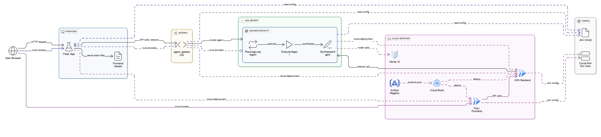

# FarmAgent — Hackathon Build Guide

## Current Status

**Note:** The "Governor Log" and "Evidence Receipts" features on the dashboard are temporarily disabled as they are undergoing improvements.

---
[](https://farmagent-frontend-10537174747.us-central1.run.app) [](https://github.com/swarajdhondge/farmagent) [](https://medium.com/@tosbidwai98/farmagent-building-a-transparent-ai-assistant-for-smarter-farming-8f5c7690e002) [](#)
---
## Overview

FarmAgent is a crop advisory agent built using the Google Agent Development Kit (ADK). It provides a web-based interface with a chat and a reasoning dashboard. The agent's core logic is designed to understand user queries about crop-related issues, create a plan to address them, execute the plan using a set of tools, and finally synthesize a human-readable answer.

The project is divided into two main parts:

- **`frontend`**: A Flask application that serves the web interface.
- **`src`**: The core agent logic, built with the Google ADK.

The agent's core logic follows a **Planner → Executor → Synthesizer** sequence, which is managed by the `FarmAgent_Orchestrator`. This is a `SequentialAgent` that ensures each step is performed in order.

## Architecture

The entire system is designed around a clear separation of concerns: a Flask frontend for user interaction and an ADK backend for the core reasoning and logic. The magic happens in the interaction between these two components, orchestrated by a well-defined agentic workflow.

Here's a visual representation of the data flow:



The agent's "thinking" process follows a Planner → Executor → Synthesizer sequence, which is managed by the `FarmAgent_Orchestrator`. This is a `SequentialAgent` that ensures each step is performed in order.

- **`agent_gateway.py`**: This module acts as a safe connector between the Flask frontend and the ADK server. It is designed to be Cloud Run-safe by avoiding proxy inheritance and managing session state explicitly.
- **`src/agent/orchestrator.py`**: This is the heart of the agent. It defines a `SequentialAgent` named `FarmAgent_Orchestrator` that composes the sub-agents responsible for planning, execution, and synthesis.
- **`src/agent/advisor`**: This directory contains the core reasoning components of the agent (Planner, Executor, Synthesizer, Governor, and Prompts).
- **`src/agent/tools`**: This directory contains the tools that the agent can use to gather information and perform actions.
- **Frontend (`frontend/app.py`)**: A Flask application serves the HTML, CSS, and JavaScript for the reasoning dashboard. It makes calls to the `agent_gateway` to interact with the agent and displays the state of the agent's reasoning process in real-time.

## End-to-End Workflow

Let's trace a typical user query, like "My tomato plant's leaves are yellowing," accompanied by an image.

1. **The Frontend: User Interaction**

   - **Input**: The user types the query into the textarea in the `index.html` page and attaches an image.
   - **Image Upload**: The `app.js` file detects the image attachment. It first sends the image to the `/upload` endpoint in `frontend/app.py`. The Flask server saves the image to a temporary directory and returns a `file://` URI for the image.
   - **Run Plan**: When the user clicks "Run Plan," `app.js` sends the user's query and the image URI to the `/run_plan` endpoint in `frontend/app.py`.
2. **The Gateway: Connecting Frontend to Backend**

   - `frontend/app.py`: The `/run_plan` route receives the query and image URI.
   - `agent_gateway.py`: `app.py` calls the `run_agent_once` function in the gateway. This module is responsible for creating a properly formatted JSON payload to send to the ADK server. This payload includes the user's query and the image data encoded in a format the ADK can understand.
   - **HTTP Request**: The gateway sends a POST request to the ADK server's `/run` or `/run_sse` endpoint. This is the handoff from the frontend to the backend.
3. **The ADK Backend: The Agent Awakens**

   - **Entry Point**: The ADK server receives the request and routes it to the `root_agent` defined in `src/agent.py`. This is our `FarmAgent_Orchestrator`.
4. **The Orchestrator: The Conductor**

   - `src/agent/orchestrator.py`: The `FarmAgent_Orchestrator` is a `SequentialAgent`, so it starts its sequence of sub-agents.
5. **The Planning Phase: Creating a Strategy**

   - `src/agent/advisor/planner.py`:
     - **Governor Pre-Check**: Before the planner's LLM is called, the `governor_callback` from `governor.py` runs. It inspects the query ("leaves are yellowing") and sees that an image is present. It logs that symptoms are mentioned and an image is provided, which is good.
     - **LLM Call**: The `planner_agent` sends the user's query and the `PLANNER_INSTRUCTION` prompt to the Gemini model. The prompt instructs the LLM to create a JSON plan.
     - **Plan Generation**: The LLM, following the instructions, generates a JSON plan.
     - **Plan Validation**: The `after_planner_callback` receives this JSON, validates it, and saves it as a string in the agent's state dictionary: `state['current_plan']`.
6. **The Execution Phase: Getting Things Done**

   - `src/agent/advisor/executor.py`: The orchestrator now moves to the `executor_agent`.
   - `run_plan_tool`: The `executor_agent`'s only job is to call the `run_plan_tool`.
   - `src/agent/tools/run_plan.py`: This tool gets the `current_plan` from the state. It then iterates through the steps, calling the appropriate tools.
   - **Logging Receipts**: Each of these tools, upon execution, calls `log_receipt_safe` from `utils.py` to write a "receipt" of its execution into `state['receipts']`. This creates a detailed audit trail of the agent's actions.
7. **The Synthesis Phase: Creating the Answer**

   - `src/agent/advisor/synthesizer.py`: This is the final step in the orchestration.
   - **Gathering Context**: The `synthesizer_agent` is given the entire conversation history, the user's original query, and, most importantly, all the receipts generated by the tools during the execution phase.
   - **LLM Call**: It sends all this context along with the `SYNTHESIZER_INSTRUCTION` prompt to the Gemini model. The prompt asks the model to create a clear, actionable recommendation.
   - **Final Response**: The LLM synthesizes all the information and generates a user-friendly paragraph explaining the findings and recommendations.
8. **The Journey Home: Displaying the Results**

   - **ADK to Gateway**: The final synthesized text is sent back from the ADK server to the `agent_gateway`.
   - **Gateway to Flask**: The gateway parses the response and sends it back to the `run_plan` route in `frontend/app.py`.
   - **Flask to JavaScript**: `app.py` packages the final output, the plan, the receipts, and any metrics into a single JSON object and returns it to the browser.
   - **`app.js` Updates UI**: The JavaScript code receives this JSON and dynamically updates the `index.html` page.

# FarmAgent — Hackathon Build Guide

## Current Status

**Note:** The "Governor Log" and "Evidence Receipts" features on the dashboard are temporarily disabled as they are undergoing improvements.

## Overview

FarmAgent is a crop advisory agent built using the Google Agent Development Kit (ADK). It provides a web-based interface with a chat and a reasoning dashboard. The agent's core logic is designed to understand user queries about crop-related issues, create a plan to address them, execute the plan using a set of tools, and finally synthesize a human-readable answer.

The project is divided into two main parts:

- **`frontend`**: A Flask application that serves the web interface.
- **`src`**: The core agent logic, built with the Google ADK.

The agent's core logic follows a **Planner → Governer → Executor → Synthesizer** sequence, which is managed by the `FarmAgent_Orchestrator`. This is a `SequentialAgent` that ensures each step is performed in order.

## Architecture

The entire system is designed around a clear separation of concerns: a Flask frontend for user interaction and an ADK backend for the core reasoning and logic. The magic happens in the interaction between these two components, orchestrated by a well-defined agentic workflow.

Here's a visual representation of the data flow:


Details on important files:

- **`agent_gateway.py`**: This module acts as a safe connector between the Flask frontend and the ADK server. It is designed to be Cloud Run-safe by avoiding proxy inheritance and managing session state explicitly.
- **`src/agent/orchestrator.py`**: This is the heart of the agent. It defines a `SequentialAgent` named `FarmAgent_Orchestrator` that composes the sub-agents responsible for planning, execution, and synthesis.
- **`src/agent/advisor`**: This directory contains the core reasoning components of the agent (Planner, Executor, Synthesizer, Governor, and Prompts).
- **`src/agent/tools`**: This directory contains the tools that the agent can use to gather information and perform actions.
- **Frontend (`frontend/app.py`)**: A Flask application serves the HTML, CSS, and JavaScript for the reasoning dashboard. It makes calls to the `agent_gateway` to interact with the agent and displays the state of the agent's reasoning process in real-time.

## End-to-End Workflow

Let's trace a typical user query, like "My tomato plant's leaves are yellowing," accompanied by an image.

1. **The Frontend: User Interaction**

   - **Input**: The user types the query into the textarea in the `index.html` page and attaches an image.
   - **Image Upload**: The `app.js` file detects the image attachment. It first sends the image to the `/upload` endpoint in `frontend/app.py`. The Flask server saves the image to a temporary directory and returns a `file://` URI for the image.
   - **Run Plan**: When the user clicks "Run Plan," `app.js` sends the user's query and the image URI to the `/run_plan` endpoint in `frontend/app.py`.
2. **The Gateway: Connecting Frontend to Backend**

   - `frontend/app.py`: The `/run_plan` route receives the query and image URI.
   - `agent_gateway.py`: `app.py` calls the `run_agent_once` function in the gateway. This module is responsible for creating a properly formatted JSON payload to send to the ADK server. This payload includes the user's query and the image data encoded in a format the ADK can understand.
   - **HTTP Request**: The gateway sends a POST request to the ADK server's `/run` or `/run_sse` endpoint. This is the handoff from the frontend to the backend.
3. **The ADK Backend: The Agent Awakens**

   - **Entry Point**: The ADK server receives the request and routes it to the `root_agent` defined in `src/agent.py`. This is our `FarmAgent_Orchestrator`.
4. **The Orchestrator: The Conductor**

   - `src/agent/orchestrator.py`: The `FarmAgent_Orchestrator` is a `SequentialAgent`, so it starts its sequence of sub-agents.
5. **The Planning Phase: Creating a Strategy**

   - `src/agent/advisor/planner.py`:
     - **Governor Pre-Check**: Before the planner's LLM is called, the `governor_callback` from `governor.py` runs. It inspects the query ("leaves are yellowing") and sees that an image is present. It logs that symptoms are mentioned and an image is provided, which is good.
     - **LLM Call**: The `planner_agent` sends the user's query and the `PLANNER_INSTRUCTION` prompt to the Gemini model. The prompt instructs the LLM to create a JSON plan.
     - **Plan Generation**: The LLM, following the instructions, generates a JSON plan.
     - **Plan Validation**: The `after_planner_callback` receives this JSON, validates it, and saves it as a string in the agent's state dictionary: `state['current_plan']`.
6. **The Execution Phase: Getting Things Done**

   - `src/agent/advisor/executor.py`: The orchestrator now moves to the `executor_agent`.
   - `run_plan_tool`: The `executor_agent`'s only job is to call the `run_plan_tool`.
   - `src/agent/tools/run_plan.py`: This tool gets the `current_plan` from the state. It then iterates through the steps, calling the appropriate tools.
   - **Logging Receipts**: Each of these tools, upon execution, calls `log_receipt_safe` from `utils.py` to write a "receipt" of its execution into `state['receipts']`. This creates a detailed audit trail of the agent's actions.
7. **The Synthesis Phase: Creating the Answer**

   - `src/agent/advisor/synthesizer.py`: This is the final step in the orchestration.
   - **Gathering Context**: The `synthesizer_agent` is given the entire conversation history, the user's original query, and, most importantly, all the receipts generated by the tools during the execution phase.
   - **LLM Call**: It sends all this context along with the `SYNTHESIZER_INSTRUCTION` prompt to the Gemini model. The prompt asks the model to create a clear, actionable recommendation.
   - **Final Response**: The LLM synthesizes all the information and generates a user-friendly paragraph explaining the findings and recommendations.
8. **The Journey Home: Displaying the Results**

   - **ADK to Gateway**: The final synthesized text is sent back from the ADK server to the `agent_gateway`.
   - **Gateway to Flask**: The gateway parses the response and sends it back to the `run_plan` route in `frontend/app.py`.
   - **Flask to JavaScript**: `app.py` packages the final output, the plan, the receipts, and any metrics into a single JSON object and returns it to the browser.
   - **`app.js` Updates UI**: The JavaScript code receives this JSON and dynamically updates the `index.html` page.

## How to Run Locally

### Prerequisites

- Python 3.10+
- A Google Cloud project with Vertex AI enabled.

### Authentication

You need to authenticate to Google Cloud for the application to work. Choose one of the following methods:

**Method 1: Application Default Credentials (Recommended for Local Development)**

For local development, the easiest way to authenticate is by using the `gcloud` CLI.

1. Install the [Google Cloud CLI](https://cloud.google.com/sdk/docs/install).
2. Run the following command to log in and create your Application Default Credentials:
   ```bash
   gcloud auth application-default login
   ```

**Method 2: Service Account Key**

For production environments or if you prefer using a service account, you can use a JSON key file.

1. **Create a service account key:**
   Follow the instructions at [Creating and managing service account keys](https://docs.cloud.google.com/iam/docs/keys-create-delete) to create and download a JSON key file. It is recommended to grant the "Vertex AI User" role to this service account.
2. **Place the key file:**
   Place the downloaded JSON file in the root of the `farmagent` directory and rename it to `service-account-key.json`.
3. **Set the environment variable:**
   The application will look for this file if the `GOOGLE_APPLICATION_CREDENTIALS` environment variable is set. While you can set this variable system-wide, for this project, you can add it to your `.env` file:
   ```env
   GOOGLE_APPLICATION_CREDENTIALS=service-account-key.json
   ```

### 1. Setup and Installation

```bash
# Navigate to the farmagent directory
cd farmagent

# Create and activate a virtual environment
# (Windows)
python -m venv .venv
.venv\Scripts\activate

# (macOS/Linux)
# python3 -m venv .venv
# source .venv/bin/activate

# Install dependencies
pip install --upgrade pip
pip install -r requirements.txt
```

### 2. Configure Environment Variables

This project uses a `.env` file for configuration. A `.env.example` file is provided as a template.

1. **Rename the file:**
   In the `farmagent` directory, rename `.env.example` to `.env`.
2. **Edit the file:**
   Open the `.env` file and replace `your-gcp-project-id` with your actual Google Cloud project ID.

   ```env
   # ADK Server Configuration
   ADK_SERVER_URL=http://127.0.0.1:8000
   ADK_APP=src
   ADK_USER_ID=user
   ADK_SESSION_ID=s_local

   # Flask UI Configuration
   FLASK_PORT=5000
   FLASK_DEBUG=True

   # Google Cloud Configuration for ADK
   GOOGLE_CLOUD_PROJECT=your-gcp-project-id
   GOOGLE_CLOUD_LOCATION=us-central1
   GOOGLE_GENAI_USE_VERTEXAI=True
   # GOOGLE_APPLICATION_CREDENTIALS=service-account-key.json
   ```

### 3. Start the Servers (2 Terminals)

**Terminal 1: Start ADK API Server**

```bash
# In the farmagent directory
adk api_server . --port=8000
```

*Note: If you encounter a doc error, you may need to set an environment variable: `$env:ADK_DISABLE_DOCS = "true"` (PowerShell) or `export ADK_DISABLE_DOCS=true` (bash). You can safely ignore "app name mismatch" warnings.*

**Terminal 2: Start UI Server**

```bash
# In the farmagent directory
python app.py
```

### 4. Access the UI

Open your browser and go to **http://127.0.0.1:5000**.

## How to Deploy to Google Cloud

This application is designed to be deployed to a serverless environment like Google Cloud Run. The deployment will consist of two separate Cloud Run services: one for the ADK backend and one for the Flask frontend.

### Prerequisites

- A GCP project with Cloud Run, Artifact Registry, and Cloud Build APIs enabled.
- `gcloud` CLI installed and configured (`gcloud init`).
- Docker installed locally or Docker configured within Cloud Shell.

### Step 1: Create a `Procfile`

The `gunicorn` web server is already in `requirements.txt`. Create a `Procfile` in the `farmagent` directory to tell Cloud Run how to start the web server for the frontend.

```
web: gunicorn --bind :$PORT --workers 1 --threads 8 app:app
```

### Step 2: Deploy the ADK Backend Service

The ADK server can be deployed as a Cloud Run service.

```bash
# In the farmagent directory
gcloud run deploy farmagent-adk-backend \
    --source . \
    --region us-central1 \
    --allow-unauthenticated \
    --set-env-vars="GOOGLE_CLOUD_PROJECT=your-gcp-project-id,GOOGLE_CLOUD_LOCATION=us-central1,GOOGLE_GENAI_USE_VERTEXAI=True" \
    --command="adk" \
    --args="api_server,.,--port,8080"
```

Take note of the URL produced for the ADK backend service.

### Step 3: Deploy the Flask Frontend Service

Now, deploy the frontend, making sure to point it to the ADK backend service you just deployed.

```bash
# Replace ADK_BACKEND_URL with the URL from the previous step
export ADK_BACKEND_URL="your-adk-backend-service-url"

gcloud run deploy farmagent-frontend \
    --source . \
    --region us-central1 \
    --allow-unauthenticated \
    --set-env-vars="ADK_SERVER_URL=$ADK_BACKEND_URL,ADK_APP=src,ADK_USER_ID=cloud_user,ADK_SESSION_ID=s_cloud"
```

### Step 4: Access Your Deployed App

Use the URL generated by the `farmagent-frontend` deployment to access your live application.

---

Live demo → https://farmagent-frontend-10537174747.us-central1.run.app/
Code → https://github.com/swarajdhondge/farmagent
Build post → https://medium.com/@tosbidwai98/farmagent-building-a-transparent-ai-assistant-for-smarter-farming-8f5c7690e002

Built for the #CloudRunHackathon.

## How to Run Locally

### Prerequisites

- Python 3.10+
- A Google Cloud project with Vertex AI enabled.

### Authentication

You need to authenticate to Google Cloud for the application to work. Choose one of the following methods:

**Method 1: Application Default Credentials (Recommended for Local Development)**

For local development, the easiest way to authenticate is by using the `gcloud` CLI.

1. Install the [Google Cloud CLI](https://cloud.google.com/sdk/docs/install).
2. Run the following command to log in and create your Application Default Credentials:
   ```bash
   gcloud auth application-default login
   ```

**Method 2: Service Account Key**

For production environments or if you prefer using a service account, you can use a JSON key file.

1. **Create a service account key:**
   Follow the instructions at [Creating and managing service account keys](https://docs.cloud.google.com/iam/docs/keys-create-delete) to create and download a JSON key file. It is recommended to grant the "Vertex AI User" role to this service account.
2. **Place the key file:**
   Place the downloaded JSON file in the root of the `farmagent` directory and rename it to `service-account-key.json`.
3. **Set the environment variable:**
   The application will look for this file if the `GOOGLE_APPLICATION_CREDENTIALS` environment variable is set. While you can set this variable system-wide, for this project, you can add it to your `.env` file:
   ```env
   GOOGLE_APPLICATION_CREDENTIALS=service-account-key.json
   ```

### 1. Setup and Installation

```bash
# Navigate to the farmagent directory
cd farmagent

# Create and activate a virtual environment
# (Windows)
python -m venv .venv
.venv\Scripts\activate

# (macOS/Linux)
# python3 -m venv .venv
# source .venv/bin/activate

# Install dependencies
pip install --upgrade pip
pip install -r requirements.txt
```

### 2. Configure Environment Variables

This project uses a `.env` file for configuration. A `.env.example` file is provided as a template.

1. **Rename the file:**
   In the `farmagent` directory, rename `.env.example` to `.env`.
2. **Edit the file:**
   Open the `.env` file and replace `your-gcp-project-id` with your actual Google Cloud project ID.

   ```env
   # ADK Server Configuration
   ADK_SERVER_URL=http://127.0.0.1:8000
   ADK_APP=src
   ADK_USER_ID=user
   ADK_SESSION_ID=s_local

   # Flask UI Configuration
   FLASK_PORT=5000
   FLASK_DEBUG=True

   # Google Cloud Configuration for ADK
   GOOGLE_CLOUD_PROJECT=your-gcp-project-id
   GOOGLE_CLOUD_LOCATION=us-central1
   GOOGLE_GENAI_USE_VERTEXAI=True
   # GOOGLE_APPLICATION_CREDENTIALS=service-account-key.json
   ```

### 3. Start the Servers (2 Terminals)

**Terminal 1: Start ADK API Server**

```bash
# In the farmagent directory
adk api_server . --port=8000
```

*Note: If you encounter a doc error, you may need to set an environment variable: `$env:ADK_DISABLE_DOCS = "true"` (PowerShell) or `export ADK_DISABLE_DOCS=true` (bash). You can safely ignore "app name mismatch" warnings.*

**Terminal 2: Start UI Server**

```bash
# In the farmagent directory
python app.py
```

### 4. Access the UI

Open your browser and go to **http://127.0.0.1:5000**.

## How to Deploy to Google Cloud

This application is designed to be deployed to a serverless environment like Google Cloud Run. The deployment will consist of two separate Cloud Run services: one for the ADK backend and one for the Flask frontend.

### Prerequisites

- A GCP project with Cloud Run, Artifact Registry, and Cloud Build APIs enabled.
- `gcloud` CLI installed and configured (`gcloud init`).
- Docker installed locally or Docker configured within Cloud Shell.

### Step 1: Create a `Procfile`

The `gunicorn` web server is already in `requirements.txt`. Create a `Procfile` in the `farmagent` directory to tell Cloud Run how to start the web server for the frontend.

```
web: gunicorn --bind :$PORT --workers 1 --threads 8 app:app
```

### Step 2: Deploy the ADK Backend Service

The ADK server can be deployed as a Cloud Run service.

```bash
# In the farmagent directory
gcloud run deploy farmagent-adk-backend \
    --source . \
    --region us-central1 \
    --allow-unauthenticated \
    --set-env-vars="GOOGLE_CLOUD_PROJECT=your-gcp-project-id,GOOGLE_CLOUD_LOCATION=us-central1,GOOGLE_GENAI_USE_VERTEXAI=True" \
    --command="adk" \
    --args="api_server,.,--port,8080"
```

Take note of the URL produced for the ADK backend service.

### Step 3: Deploy the Flask Frontend Service

Now, deploy the frontend, making sure to point it to the ADK backend service you just deployed.

```bash
# Replace ADK_BACKEND_URL with the URL from the previous step
export ADK_BACKEND_URL="your-adk-backend-service-url"

gcloud run deploy farmagent-frontend \
    --source . \
    --region us-central1 \
    --allow-unauthenticated \
    --set-env-vars="ADK_SERVER_URL=$ADK_BACKEND_URL,ADK_APP=src,ADK_USER_ID=cloud_user,ADK_SESSION_ID=s_cloud"
```

### Step 4: Access Your Deployed App

Use the URL generated by the `farmagent-frontend` deployment to access your live application.
